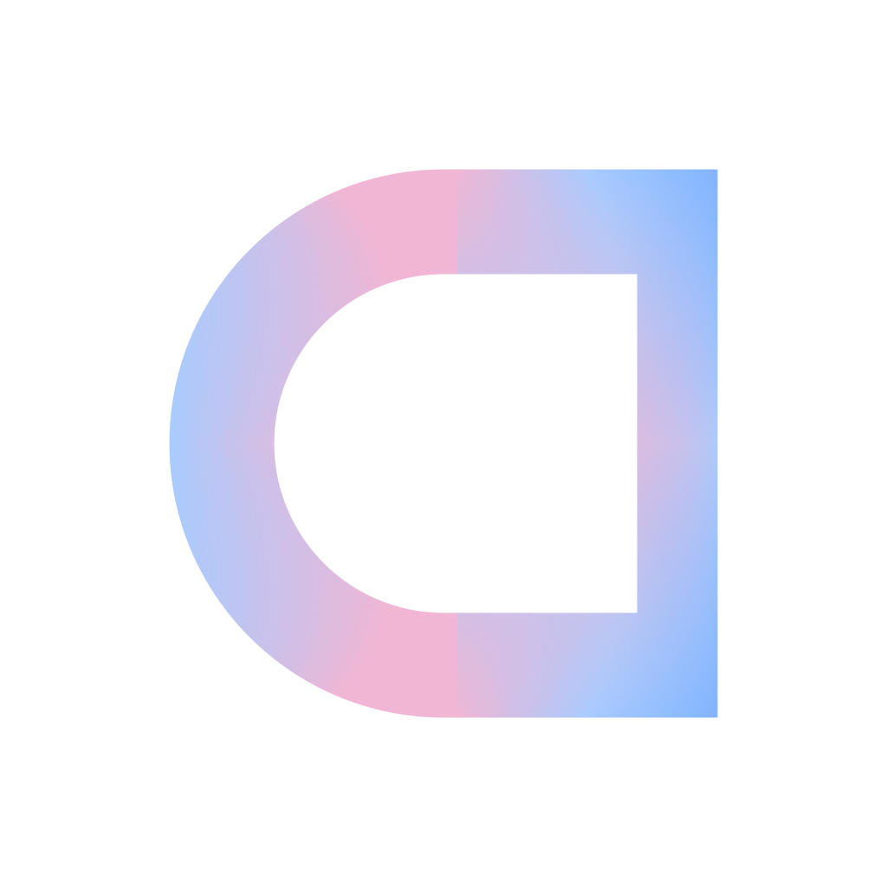

<h1 align="center">Cyclauncher</h1>

<p align="center">
  
</p>

<p align="center">
  <a href="https://f-droid.org/packages/dev.msbs.cyclauncher/">
    
  </a>
</p>

<p align="center">
  <a href="https://f-droid.org/packages/dev.msbs.cyclauncher/">
    
  </a>
  <a href="https://github.com/msbluesnow/Cyclauncher/actions/workflows/fdroid-check.yml">
    
  </a>
</p>

Cyclauncher is **not just yet another bicycle**. Built with **Jetpack Compose**, it is focused on speed, effortless app accessibility, and seamless one-handed usability. New features and mechanics are continuously designed not just to be unique, but to deliver a genuinely convenient, ergonomic, and practical daily experience. Fast and intuitive navigation is provided via versatile search methods including a custom rectangular alphabet wheel, an ergonomic side alphabet index strip, and instant text filtering.

> [!IMPORTANT]
> **Alpha Version**: This project is currently in early development. Features are subject to change, and bugs may be encountered as the experience is refined.

## 📽️ Demo Showcases

<table style="width: 100%; border: none;">
  <tr>
    <td align="center" style="border: none; width: 33%;">
      <b>Uninstalling apps</b><br><br>
      <video src="https://github.com/user-attachments/assets/d769d4b5-c7e7-4843-abf8-8f19cb0b5ae6" width="100%" autoplay loop muted playsinline></video>
    </td>
    <td align="center" style="border: none; width: 33%;">
      <b>Remove apps from history</b><br><br>
      <video src="https://github.com/user-attachments/assets/ff1584bd-d147-4c3f-97f9-5dbdfd1145b9" width="100%" autoplay loop muted playsinline></video>
    </td>
    <td align="center" style="border: none; width: 33%;">
      <b>Change accent color and search for applications</b><br><br>
      <video src="https://github.com/user-attachments/assets/4f253962-1167-4a46-ab79-d45350c8709a" width="100%" autoplay loop muted playsinline></video>
    </td>
  </tr>
</table>

## ✨ Key Features

- **Tag Folder System**: Interactive tag folders on the main screen with color accents, 2x2 live icon previews, and proximity-aware popup menus for seamless category management and launching.
- **Versatile Search Modes**: Fast app access via a custom **Rectangular Alphabet Wheel**, an ergonomic **Side Alphabet Index** strip for rapid thumb scrubbing, or instant **Text Search**.
- **Interactive Gesture Tutorial**: Guided hands-on onboarding overlay teaching launcher gestures (search, notifications, favorites & history management, system navigation) with animated visualizers.
- **Dynamic Favorites**: Organize your top apps with intuitive drag-and-drop reordering (long-press star to enter) and quick-removal tools.
- **AI-Powered Organization**: Categorize your apps efficiently with an AI-assisted tagging workflow (Export → Process via External AI Prompt → Import) and full tag backup support. *Note: AI processing is performed externally using your preferred provider.*
- **Flexible Data Management**: Robust import/export support for app names and tags in both JSON and plain text formats.
- **Customizable Themes**: Selectable accent colors, customizable main text color (Black/White) via an interactive switcher, and adaptive shadow inversion for optimal contrast on any wallpaper.

## 🤝 Community & Support

- **Discord**: Join the community for feedback and updates: [](https://discord.gg/Zw4EBe92Qn)
- **Contributing**: Check out [CONTRIBUTING.md](CONTRIBUTING.md) to learn how to set up the project and submit pull requests.
- **Tribute**: Support the development of this project: [](https://web.tribute.tg/e/1dW)

## 🛠 Tech Stack

- **Language**: [Kotlin](https://kotlinlang.org/)
- **UI Framework**: [Jetpack Compose](https://developer.android.com/jetpack/compose)
- **Architecture**: MVVM with StateFlow
- **Graphics**: High-performance animations powered by the low-level Canvas API.
- **Documentation**: Enriched with comprehensive inline KDoc for improved maintainability.

## 🚀 Getting Started

Testing of this alpha version is performed by cloning the repository and running it via Android Studio.

1. The repository is cloned: `git clone https://github.com/msbluesnow/Cyclauncher.git`
2. The project is opened in **Android Studio Ladybug (or newer)**.
3. The application is built and deployed to a device.

### CLI Build Instructions
For automated systems or command-line enthusiasts, the application is built using the following commands:
```bash
chmod +x gradlew
./gradlew assembleRelease
```

## 🗺️ Roadmap

A continuous, unified timeline of completed milestones and planned updates.

<kbd>&nbsp;✓&nbsp;</kbd> <b>Letter-Based Scroll Wheel</b> — Interactive rectangular scroll wheel for high-performance app retrieval.<br>
<kbd>&nbsp;✓&nbsp;</kbd> <b>Side Alphabet Search Mode</b> — Ergonomic alphabet index strip for swift one-handed scrubbing and app indexing.<br>
<kbd>&nbsp;✓&nbsp;</kbd> <b>Tag Folder System</b> — On-screen tag folders with multi-app previews, quick popups, and full management.<br>
<kbd>&nbsp;✓&nbsp;</kbd> <b>Application Tag System</b> — Grouping apps with an AI-assisted tagging workflow and full JSON backup options.<br>
<kbd>&nbsp;✓&nbsp;</kbd> <b>Adaptive Text & Theme Accents</b> — Selectable accent palettes, a custom Main Color (Black/White) switcher, and dynamic shadow inversion.<br>
<kbd>&nbsp;✓&nbsp;</kbd> <b>Performance Tuning</b> — Asynchronous Coil icon prefetching with safe path filters, and cached default launcher checks to eliminate main thread IPC jank.<br>
<kbd>&nbsp;✓&nbsp;</kbd> <b>Interactive Gesture Tutorial</b> — Guided onboarding overlay teaching launcher gestures with animated visualizers.<br>
<kbd>&nbsp;&nbsp;&nbsp;</kbd> <i>Tag Map</i> — Interactive tag map showing connections between applications and implementing quick tag-based navigation.<br>
<kbd>&nbsp;&nbsp;&nbsp;</kbd> <i>App Shortcuts</i> — Quick-launch actions like dialing specific contacts or opening deep-linked settings.<br>
<kbd>&nbsp;&nbsp;&nbsp;</kbd> <i>Widgets Integration</i> — Full support for configuring and pinning dynamic Android widgets on the home layout.<br>
<kbd>&nbsp;&nbsp;&nbsp;</kbd> <i>Localization</i> — Native translation support for multiple popular world languages.<br>
<kbd>&nbsp;&nbsp;&nbsp;</kbd> <i>3D Hex Search Grid</i> — Immersive 3D application navigation styled as a rotatable hexagonal prism.<br>


## ⚠️ Known Issues

### Custom ROM Gesture Interception (crDroid / LineageOS / Quickstep)
* **Symptom:** When switching between Cyclauncher (or any third-party launcher) and the built-in system launcher (e.g., Trebuchet on crDroid / LineageOS), the SystemUI gesture navigation bar may occasionally fail to trigger the "Home" animation or open Recents Overview when opening a non-default launcher directly.
* **Root Cause:** This is a system-level behavior in custom ROMs (crDroid / LineageOS) where the bundled SystemUI/Quickstep provider is compiled into `/system/priv-app/`. When a non-default launcher with `CATEGORY_HOME` in its manifest is opened, Quickstep suppresses the Home swipe animation to prevent feedback loops between launcher activities.
* **Workaround / Resolution:** Cyclauncher automatically mitigates this behavior via native `onUserLeaveHint()` lifecycle handlers that finish the activity when a Home gesture is performed while non-default. If gestures become unresponsive on custom ROMs, simply re-select your preferred launcher in **Settings → Default Apps → Home app**.

## 📜 License

This project is licensed under the **GNU GPLv3** - see the [LICENSE](LICENSE) file for details.

---
*Developed with ❤️ using Jetpack Compose.*
